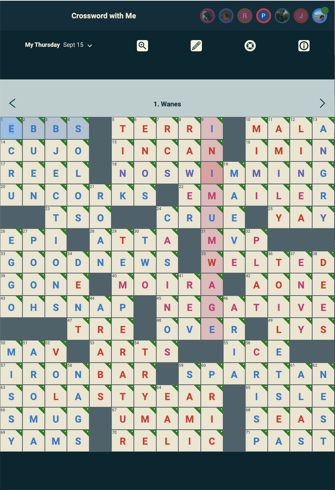

# Live Demo

https://crosswordwith.me

# Screenshots 

## Responsive Views

<figure>
  <figcaption>Mobile</figcaption>
  
</figure>
<figure>
  <figcaption>Tablet</figcaption>
  
</figure>
<figure>
  <figcaption>Desktop</figcaption>
  
</figure>

## Multi-player Gameplay

# Tech Stack

* Responsive Design
  * Flexbox & CSS Grid
  * Mobile-first media queries
* Modern React (v18)
  * Functional Components & Hooks
  * React Router
  * MaterialUI 
* Modern Redux
  * Redux Toolkit
* WebSockets
  * socket.io for real-time multi-player collaboration
* Server
  * node.js + Express
* Authentication
  * Google Identity Services + Firebase
* NoSQL Database
  * Firebase Real-Time Database
* Serverless Functions
  * Firebase Scheduled Cloud Functions (to pull and save daily puzzle)
* Heroku  
  * Hosting
  * Staging & Production environments
* DNS
  * Google Domains CNAME and forwarding

## Development Tools
* Create React App
* Chrome React / Redux DevTools
* nodemon
* Firebase Emulator Suite

## Build / Code Quality Tools
* Webpack
* ESLint
* Jest for Tests
  * server-side complete
  * client-side TO DO
  
# To Do 
* If puzzle fetch fails, send message to me
  * Other monitoring
* Alert player when puzzle complete and correct
  * Streaks, scores
* Display when avatar icons exceed title bar
  * Allow custom colors
* Chat Functionality
  * To discuss game, etc. 
* Allow anonymous players
  * Clear anonymous games from the database every night

